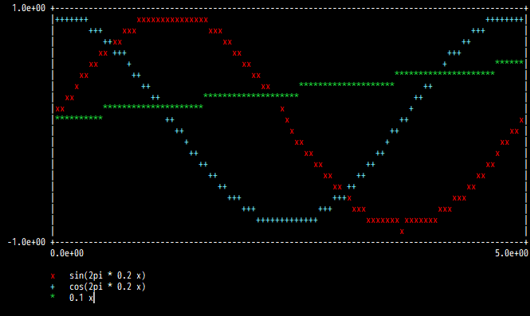

# TUI Plot Tool
Making a figure with text-based user interface.

I made this for remote terminals without graphics.


## Dependencies
`curses` module only (included in the standard library).


## Usage
`src/tuiplot.py` is the main script.
Copy it to your directory and use as in `src/example.py`


## Example
Just run an example script:
```
$ python src/example.py
```

A docker example is also available (docker and make are required):
```
$ make
$ make run
```

And they will yield:


(text version)
```
  1.0e+00 +--------------------------------------------------------------------------------------------------+
          |+++++++          xxxxxxxxxxxxxxx                                                          ++++++++|
          |       +++    xxx               xxx                                                    +++        |
          |          ++xx                     xx                                                ++           |
          |         xx +++                      xx                                           +++             |
          |       xx      +                       xx                                        +          ******|
          |     xx         ++                       xx                            *********************      |
          |    x             ++                       xx      ********************      ++                   |
          |  xx                ++         ********************                        ++                     |
          |xx        *********************                x                          +                       |
          |**********             ++                       x                       ++                       x|
          |                         ++                      x                    ++                       xx |
          |                           +                      xx                 +                       xx   |
          |                            ++                      xx             ++                       x     |
          |                              ++                      xx         ++                       xx      |
          |                                ++                      xx     ++                       xx        |
          |                                  ++                      xx ++                       xx          |
          |                                    +++                   +++x                     xxx            |
          |                                       +++             +++    xxx               xxx               |
          |                                          +++++++++++++          xxxxxxx xxxxxxx                  |
          |                                                                        x                         |
 -1.0e+00 +--------------------------------------------------------------------------------------------------+
          0.0e+00                                                                                      5.0e+00
                                                                                                              
          x   sin(2pi * 0.2 x)                                                                                
          +   cos(2pi * 0.2 x)                                                                                
          *   0.1 x                                                                                           
                                                                                                              
```


## Others
To check available colors in your environment, the following page will be helpful: https://stackoverflow.com/a/22166613
